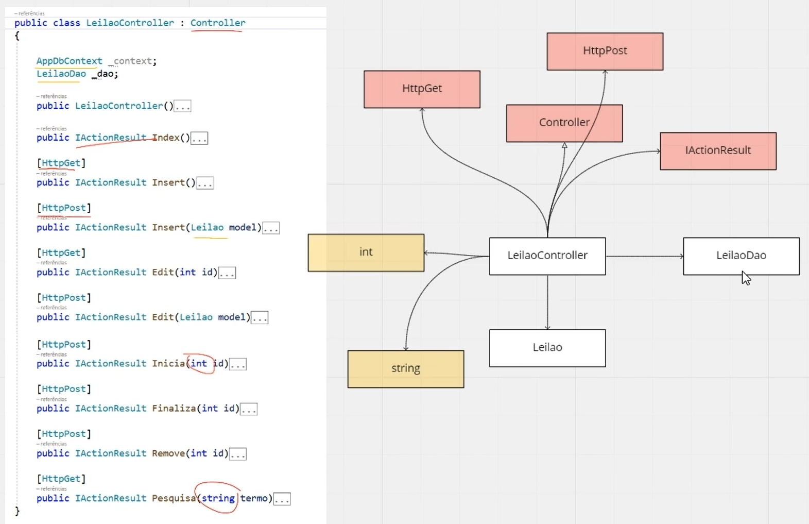
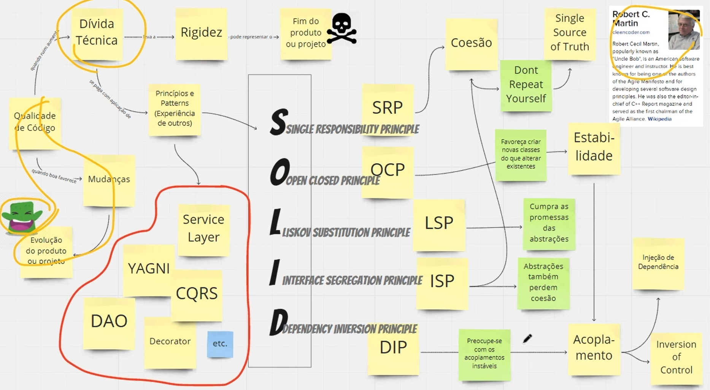

# SOLID With C#
---

## SRP -> Single Responsability Principle
---

* Código repetido é uma forma específica de conhecimento repetido (DRY)
* Repetição de código é ruim porque impacta nos custos de manutenção e aumenta sua dívida técnica
* Repetição de código pode indicar que métodos e classes possuem muitas responsabilidades
* Métodos e classes devem ter 1 única responsabilidade! Só assim serão coesos
* A responsabilidade de um método é executar uma única função
* A responsabilidade de uma classe é responder a mudanças originadas por uma única pessoa, função ou área de negócio (agente de mudança)
* Essas idéias foram sintetizadas no Princípio da Responsabilidade Única (SRP) cunhado por Robert Martin

## OCP - Open/Close Principle
* Código repetido é um risco para o negócio
* Crie uma camada de serviços para separar as funcionalidades de sua aplicação (Service Layer)
* Minimize a alteração de código que está pronto (fechado) mas garanta que seu projeto continue estensível (aberto); esse é o terceiro
* Princípio S.O.L.I.D. e é chamado de Open/Closed Principle
* O padrão Decorator é utilizado para aplicar o OCP na prática: uma nova classe é criada que apenas decora uma existente

## LSP - Liskov Substitution Principle
O Princípio de Substituição de Liskov diz que objetos podem ser substituídos por seus subtipos sem que isso afete a execução correta do programa.

Objetos podem ser substituídos por seus subtipos sem que isso afete a execução correta do app.
		
Esse principio tem o objetivo de manter o funcionamento do código integro no processo de aclopamento das funcionalidades do app.

Classes derivadas devem poder substituídas por suas classes base e que classes base podem ser substituídas por qualquer uma das suas subclasses.
Uma subclasse deve sobrescrever os métodos da superclasse de forma que a funcionalidade do ponto de vista do cliente continue a mesma.

Esse princípio é quebrado em situações nas quais uma subclasse deixa de herdar um comportamento da classe pai, seja sobrescrevendo um método e lançando uma exceção ou não tirando proveito de todas as funcionalidades dela. 
Chamamos esse cenário de Refused Bequest.

## ISP - Interface Segragation Principle
Prefira sempre interface a classes abstratas”
Utilizando uma interface você acaba evitando de ter que construir uma classe abstrata para fazer herança dela em outro lugar.

O ISP ele diz o seguinte: “Classes não devem ser forçadas a depender de métodos que não usam”.

Então além de promover a ideia da programação voltada à interface, este principio conduz a você não tentar reaproveitar suas interfaces, porque “muitas interfaces específicas são melhores do que uma interface única.

## DIP -> Dependency Inversion Principle
---

#### Acoplamentos
Acoplamento diz respeito à dependência entre dois tipos. Num sistema orientado a objetos os acoplamentos são inevitáveis. O que devemos fazer é cuidar de sua qualidade. 
Acoplamentos bons são aqueles para tipos estáveis (que não vão mudar ou tem alta probabilidade de não mudar). 
Candidatos a tipos estáveis são aqueles que fazem parte da plataforma .NET e de APIs muito usadas. 
Acoplamentos ruins são aqueles para tipos instáveis. 
Exemplos dessa categoria são os tipos criados especificamente para nossa aplicação e principalmente implementações para mecanismos específicos (conforme exemplo d LeilaoDaoEFCore).

#### Princípio e Conceitos
Crie abstrações e dependa delas para melhorar a qualidade do acoplamento. 
Esse hábito é formalizado através do Princípio da Inversão das Dependências (DIP), a letra D na sigla S.O.L.I.D.

Explicite as dependências de uma classe. Uma das maneiras de fazer isso é usando parâmetros do construtor. Desse jeito aplicamos um conceito chamado Injeção de Dependência (DI). AspNet Core ajuda a injetar as dependências que foram vinculadas no método ConfigureServices() da classe Startup e assim dizemos que o AspNet Core tem como uma de suas principais funcionalidades ser um container de injeção de dependências.

#### O que foi feito para implementar o DIP:
* Criação de abstração para as operações de acesso aos dados de leilões (ILeilaoDao)
* Renomeação da implementação de ILeilaoDao para acesso via Ef Core
* Criação de novo namespace LeilaoOnline.WebApp.Dados.EFCore para organizar as implementações do Ef Core
* Mudança dos tipos dos campos _dao nos controladores e criação de construtores para receberem os objetos injetados pelo AspNet Core
* Inclusão do serviço ILeilaoDao com sua implementação LeilaoDaoComEfCore

## YAGNI - You Aint Gonna Need It
Essa idéia vem de outra metodologia ágil chamada XP (Extreme Programming) e cunhada no livro de Ron Jeffries (mais um signatário do manifesto ágil) Extreme Programming Installed. Existe um livro com custo/beneficio que possui um abordagem mais ampla: "eXtreme Programming
Práticas para o dia a dia no desenvolvimento ágil de software".

## CQRS - Command Query Responsability Segregation
 Como o nome já diz, é sobre separar a responsabilidade de escrita e leitura de seus dados. CQRS é um pattern, um padrão arquitetural assim como Event Sourcing, Transaction Script e etc.

 Nesse projeto foi usado o CQRS para separar os comandos de INSERT, UPDATE e DELETE na camada Dados -> CQRS -> ICommand e SELECT na interface IQuery.

 ## Conteúdo abordado nesse projeto

