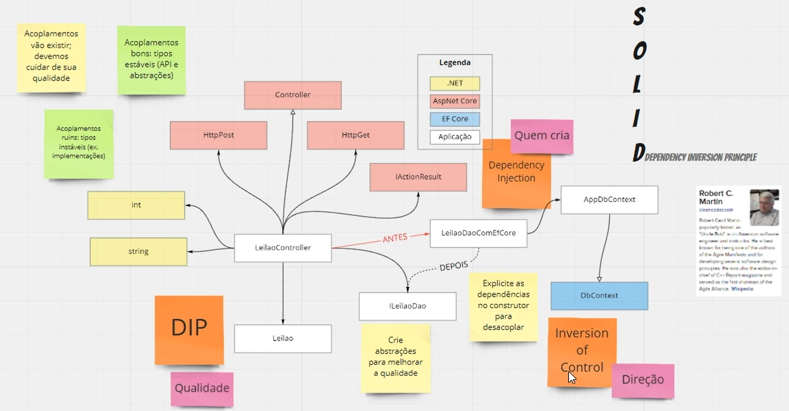

# SOLID With C#
---

## SRP -> Single Responsability Principle
---

* Código repetido é uma forma específica de conhecimento repetido (DRY)
* Repetição de código é ruim porque impacta nos custos de manutenção e aumenta sua dívida técnica
* Repetição de código pode indicar que métodos e classes possuem muitas responsabilidades
* Métodos e classes devem ter 1 única responsabilidade! Só assim serão coesos
* A responsabilidade de um método é executar uma única função
* A responsabilidade de uma classe é responder a mudanças originadas por uma única pessoa, função ou área de negócio (agente de mudança)
* Essas idéias foram sintetizadas no Princípio da Responsabilidade Única (SRP) cunhado por Robert Martin

## DIP -> Dependency Inversion Principle
---

#### Acoplamentos
Acoplamento diz respeito à dependência entre dois tipos. Num sistema orientado a objetos os acoplamentos são inevitáveis. O que devemos fazer é cuidar de sua qualidade. 
Acoplamentos bons são aqueles para tipos estáveis (que não vão mudar ou tem alta probabilidade de não mudar). 
Candidatos a tipos estáveis são aqueles que fazem parte da plataforma .NET e de APIs muito usadas. 
Acoplamentos ruins são aqueles para tipos instáveis. 
Exemplos dessa categoria são os tipos criados especificamente para nossa aplicação e principalmente implementações para mecanismos específicos (conforme exemplo d LeilaoDaoEFCore).

#### Princípio e Conceitos
Crie abstrações e dependa delas para melhorar a qualidade do acoplamento. 
Esse hábito é formalizado através do Princípio da Inversão das Dependências (DIP), a letra D na sigla S.O.L.I.D.

Explicite as dependências de uma classe. Uma das maneiras de fazer isso é usando parâmetros do construtor. Desse jeito aplicamos um conceito chamado Injeção de Dependência (DI). AspNet Core ajuda a injetar as dependências que foram vinculadas no método ConfigureServices() da classe Startup e assim dizemos que o AspNet Core tem como uma de suas principais funcionalidades ser um container de injeção de dependências.

#### O que foi feito para implementar o DIP:
* Criação de abstração para as operações de acesso aos dados de leilões (ILeilaoDao)
* Renomeação da implementação de ILeilaoDao para acesso via Ef Core
* Criação de novo namespace LeilaoOnline.WebApp.Dados.EFCore para organizar as implementações do Ef Core
* Mudança dos tipos dos campos _dao nos controladores e criação de construtores para receberem os objetos injetados pelo AspNet Core
* Inclusão do serviço ILeilaoDao com sua implementação LeilaoDaoComEfCore